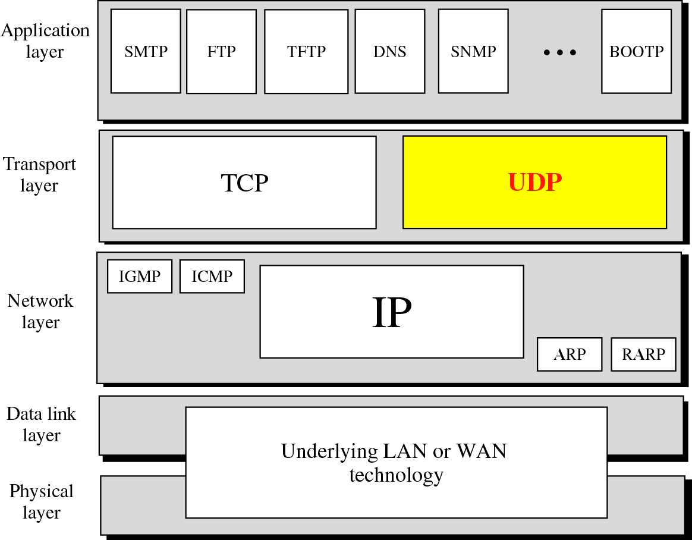

# بسم الله الرحمن الرحيم

## Network Protocols and Devices

### Chapter Objectives
- Define the meaning of Network Protocol and its benefits
- Understand Basics of TCP/IP
- Understand Basics of Addressing
- Understand Basics of IEEE LAN Standards
- Compare between different devices used in networking
- Understand differences between - Collision Domain and Broadcast Domain
- Understand Fragmentation

### Network Communication Protocols

### The Need for Protocols
- Protocols are needed for computer networks to communicate efficiently
- Network protocols are set of rules that enable data to flow from one NIC to another
- Protocols control the messages origination, the messages end, and the messages quantity in the network.

### Major Networking Protocols
- NetBIOS
- NetBEUI
- IPX/SPX
- AppleTalk
- TCP/IP

### NetBIOS
- Network Basic Input / Output System
- Common Protocol that allows Applications in LAN to communicate
Originally developed by IBM (for LAN Manager)
- Obtained by Microsoft for Windows NT and LAN Manager
- Non-routable

### NetBEUI
- NetBIOS Extended User Interface. 
- This is an enhanced version of the NetBIOS protocol used by network operating systems (NOS), such as Microsoft's Windows NT.
- Non-routable 

### IPX/SPX
- Internet Packet Exchange / Sequenced Packet Exchange
- A communications protocol devised by Novell for Novell NetWare.
- IPX/SPX packets can be routed from one network to another
Used Mainly for SAN Storage

### NetWare
- Computer Network Operating System
- Developed by Novell, Inc.
- Initially used cooperative multitasking to run various services with network protocols
- Ran a proprietary star network topology

### SAN Storage
- Storage Area Network
- High Speed subnetwork of shared Storage Devices
- Storage Device: machine that contains nothing but a disk or disks for storing data

### IPX/SPX Advantages and Disadvantages
- Advantages
  - Ease of setup.
  - Support for routing between networks.
  - Speeds greater than TCP/IP for NT.

- Disadvantages
  - Slower than NetBEUI.
  - IPX/SPX is not a vendor neutral

### AppleTalk
- Set of LAN communication protocols
- Originally created for Apple computers
- Support up to 32 devices
- Data can be exchanged at a speed of 230.4 kilobits per second (Kbps)

### TCP/IP
- Transmission Control Protocol / Internet Protocol
- TCP/IP is open standard protocol
  - Not tied to one vendor
- TCP / IP is the Internet stack of Protocols
- It is the default protocol
  - Every Operating System

### Why TCP/IP?
- Standard
- Routable 
- Cross Platform

